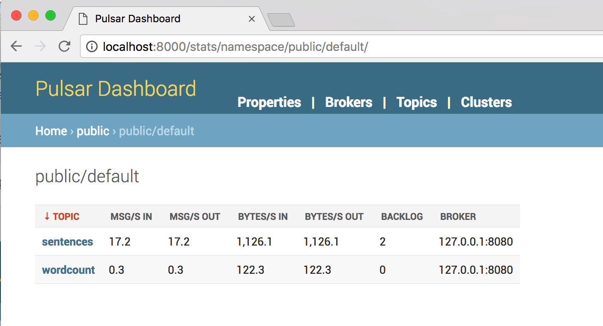
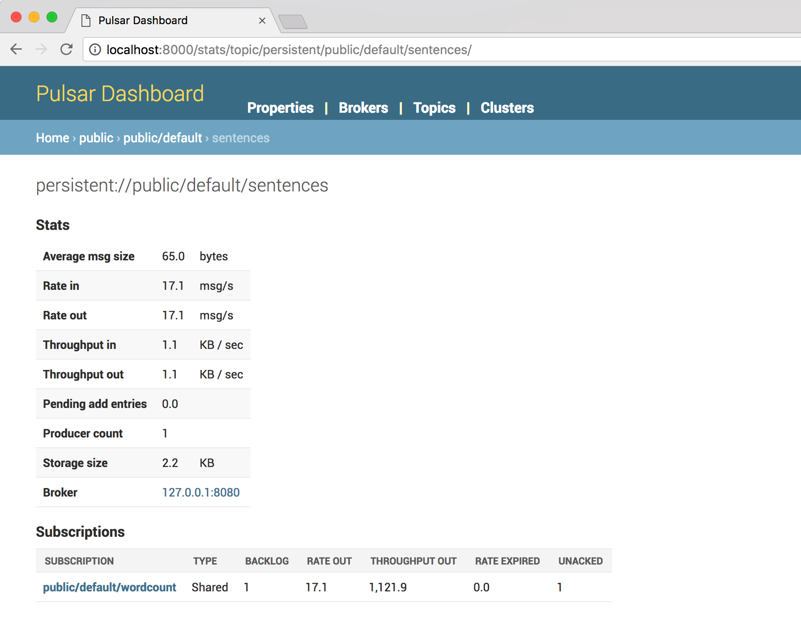
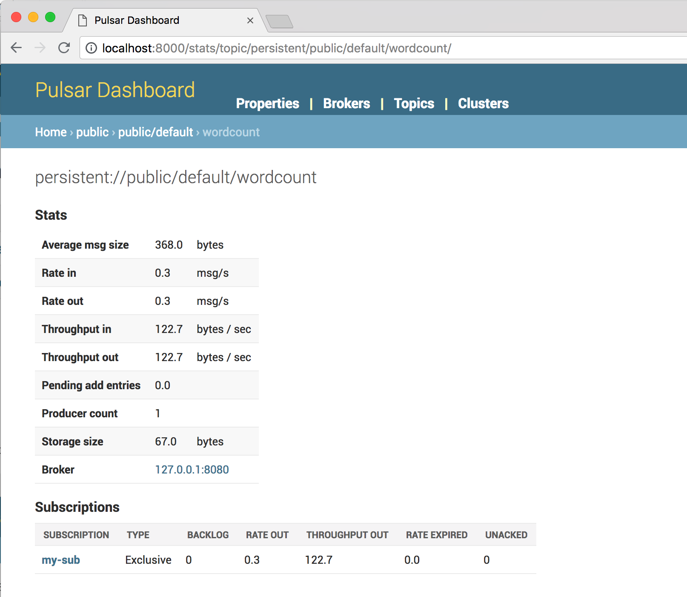

# firstdrops-pulsar image

This repo houses all of the assets for firstdrops-pulsar. Firstdrops-pulsar images combine two platforms---[Apache Pulsar](https://pulsar.incubator.apache.org) (incubating), and [Apache BookKeeper](https://bookkeeper.apache.org)---into a single Docker image.

The `producer.py` and `consumer.py` scripts are processes that you'll run outside the Docker container; the gray section in the middle shows everything inside the container.

## Requirements

### Pulsar Client

The `consumer.py` and `producer.py` Python scripts require the `pulsar-client` library to run. You can install it using [pip](https://pip.pypa.io/en/stable/installing/):

```bash
pip install pulsar-client --upgrade
```

You have two options for running firstdrops-pulsar. You can run it using [Docker](#docker) or on a [Kubernetes](#kubernetes) cluster.

### Docker

In order to run firstdrops-pulsar, you'll need to have a Docker engine running locally. You can find installation instructions for your platform below:

**MacOS**: [Download Link](https://docs.docker.com/docker-for-mac/install/)

**Linux**: [Download Link](https://docs.docker.com/engine/installation/linux/docker-ce/ubuntu/)

### Kubernetes

> If you'd prefer to build the Docker image from source rather than pulling from Docker Hub, see the [instructions below](#run-the-sandbox-image-from-source-files).

You can check to make sure the image is running using `docker ps`, which should output something like this:

```
CONTAINER ID        IMAGE               ...                                                                                              
c90100be5ea8        firstdrops-pulsar   ...
```


### Ports Explanation

As you can see, the image requires several open ports. The table below examples what each port is used for.

| Component        | Host Port     | Docker Container Port |
| ---------------- | ------------- | --------------------- |
| Pulsar Broker    | 6650          | 6650                  |
| Pulsar Admin     | 8080          | 8080                  |
| Pulsar UI        | 8000          | 8000                  |


## Get the current function status

```bash
curl http://localhost:8080/admin/v2/functions/public/default/messagecount/status

{
  "functionStatusList": [{
    "running": true,
    "numProcessed": "2347",
    "numSuccessfullyProcessed": "2347",
    "lastInvocationTime": "1530237837516",
    "instanceId": "0"
  }]
}
```

## Examine Pulsar topics

You can get insight into Pulsar topics using the [Pulsar Dashboard](http://pulsar.incubator.apache.org/docs/latest/admin/Dashboard/). The sandbox uses two topics: `sentences` and `wordcount`. You can get info on those topics by navigating to http://localhost:8000/stats/namespace/sample/standalone/ns1 in your browser.

> The Pulsar Dashboard updates once every minute.

You can see the input and output topics in Pulsar:



You can also drill down into the stats of the input topic queue (named `sentences`):



We can also take a look at the `wordcount` topic, which contains word count results:



## Shut down and remove the image

Once you're finished working with firstdrops-pulsar, you can kill the running container:

```bash
$ docker kill firstdrops-pulsar
```

You can also remove the container at any time:

```bash
$ docker rm firstdrops-pulsar
```

## Run the docker image from source files

### Maven

Maven is required to build the Pulsar topology from source (the topology is written in Java). Please follow the instructions [here](https://maven.apache.org/install.html) if not present on your system.


### Build and copy the Function jar

```bash
$ mvn package
$ cp target/firstdrops-pulsar-latest.jar ./docker/
```

### Build the Docker Image

```bash
$ docker build docker/ -t firstdrops-pulsar:latest

# Check to make sure that the image has been installed
$ docker images
```

### Run a container based on the image

```bash
$ docker run -d \
  --name firstdrops-pulsar \
  -p 6650:6650 \
  -p 8080:8080 \
  -p 8000:8000 \
  firstdrops-pulsar:latest
```

Check that the image is running using `docker ps`.
